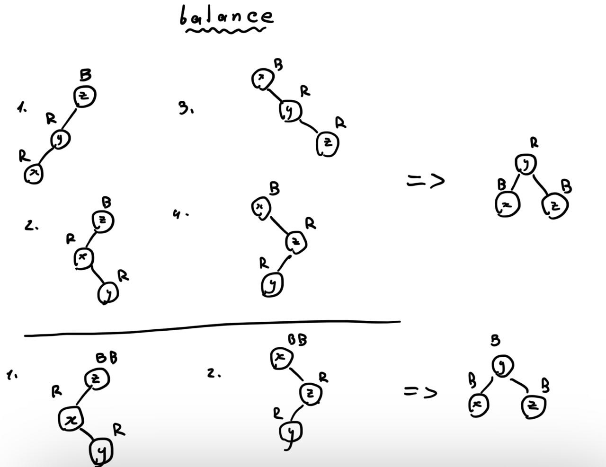
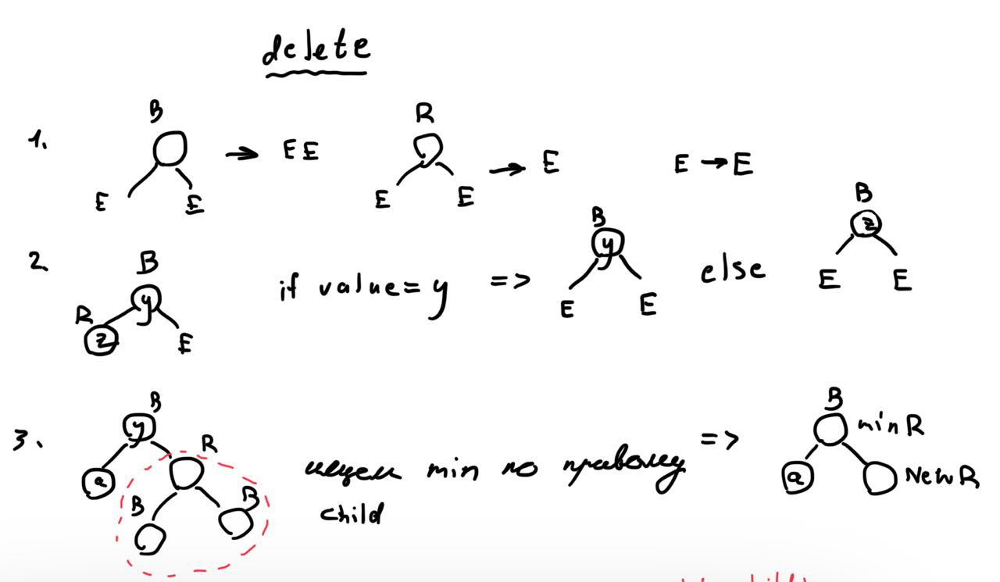
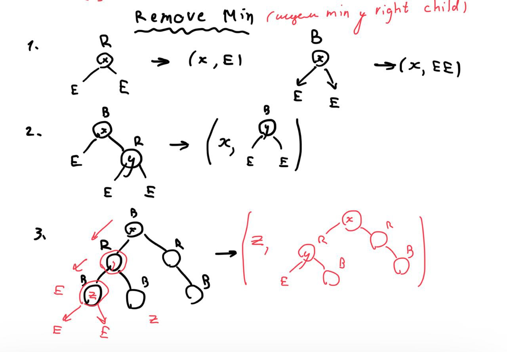
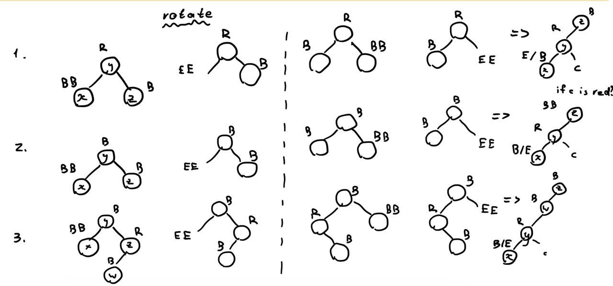

# Lab2

## Титульный лист

- Студент: `Хабнер Георгий Евгеньевич`
- Группа: `P3331`
- ИСУ: `368982`
- Вариант: `rb-set`

---

## Цель
Освоиться с построением пользовательских типов данных, полиморфизмом, рекурсивными алгоритмами и средствами тестирования (unit testing, property-based testing).

## Требования
В рамках лабораторной работы вам предлагается реализовать одну из предложенных классических структур данных (список, дерево, бинарное дерево, hashmap, граф и т.д.).  

### Функции:
- Добавление и удаление элементов.
- Фильтрация.
- Отображение (map).
- Свертки (левая и правая).
- Структура должна быть моноидом.

### Условия:
- Структуры данных должны быть неизменяемыми.
- Библиотека должна быть протестирована в рамках unit testing.
- Библиотека должна быть протестирована в рамках property-based тестирования (как минимум 3 свойства, включая свойства моноида).
- Структура должна быть полиморфной.
- Требуется использовать идиоматичный для технологии стиль программирования. 

Примечание: некоторые языки позволяют получить большую часть API через реализацию небольшого интерфейса. Так как лабораторная работа про ФП, а не про экосистему языка -- необходимо реализовать их вручную и по возможности -- обеспечить совместимость.

## Ключевые элементы реализации

### Определение типов данных
```elm
type Color
    = Red
    | Black
    | DoubleBlack

type RBTree a
    = Empty
    | DoubleEmpty
    | Node Color (RBTree a) a (RBTree a)
```

### Monoid
Реализованное дерево является моноидом относительно операции merge с пустым деревом в качестве пустого элемента.

Свойства ассоциативности и нейтрального элемента пероверены с помощью property-based тестов.

### Реализация балансироваки

* Совершается через повороты и перекраску для сохранения свойств красно-черного дерева.

<!-- insert image from resources -->


### Реализация добавления

* Добавление происходит по аналогии с бинарным деревом поиска, но с дополнительными правилами (балансировкой) для сохранения свойств красно-черного дерева.

### Реализация удаления

* Удаление происходит по аналогии с бинарным деревом поиска, но с дополнительными правилами для сохранения свойств красно-черного дерева.



* В третьем случае необходимо найти минимальный элемент в правом поддереве и заменить им удаляемый элемент. 



* Далее происходят повороты и перекраска для сохранения свойств красно-черного дерева.



* После поворотов могут возникать ситуации, когда необходимо произвести перекраску, поэтому производится балансировка полученного дерева. (к примеру узел `c` может оказаться красным)

* Последним действием является перекраска корня в черный цвет.

### Тестирование

* Для тестирования были написаны unit тесты и property-based тесты.

* Unit тесты проверяют корректность работы функций с различными входными данными.

* Property-based тесты проверяют свойства структуры данных (моноид, балансировка, свойства красно-черного дерева).

#### Отчет о тестировании

* Всего было написано 30 unit тестов из которых проверялись функции на дереве Int и дереве специального типа Person (свойства: возраст, имя) и 6 property-based тестов.

* Все тесты прошли успешно.